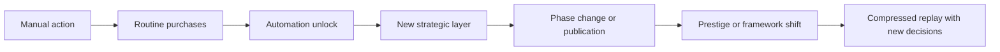
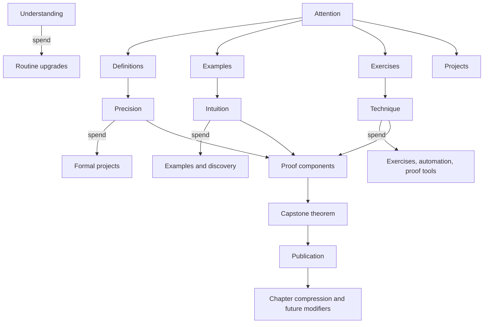

# Analysis Idle v2 Deep Research Completion Audit

## Executive summary

The existing Analysis Idle v2 foundation is directionally better than the original game, but it is **not yet implementation-ready**. Its strongest ideas—progressive disclosure, automation replacing solved labor, chapter-specific mechanics, and prestige as transformation rather than a mere multiplier—are all consistent with the strongest patterns in successful incremental games. The same sources also show why the foundation is still incomplete: it has not yet proved that its core loop avoids becoming a solved slider-allocation problem, it has not fully specified upgrades and milestones, it has not justified prestige timing, and it has not produced a reproducible simulation package that can falsify dominant strategies before implementation. citeturn23news0turn22news0turn12search0turn25search0turn26search0turn26search2turn21search1turn19academia0turn19academia1turn6academia0

The evidence base supports several strong corrections. First, the game should **not** rely on repetitive active clicking: Anthony Pecorella’s long-cited genre argument—that widespread auto-clicker use indicates a design flaw rather than “serious play”—still matches the broader genre literature and the evolution of successful games toward automation, controlled bursts, and strategic resets. Second, “waiting” is only acceptable when it follows a plan, preserves visible progress, and sets up a meaningful return decision; recent disengagement research argues that exits and returns should be designed constructively rather than as manipulative friction. Third, achievement rewards should skew toward **challenging but achievable** objectives rather than passive threshold spam; a large 2024 Steam achievement study found that players prefer intermediate, justifiable persistence rather than trivial or extreme persistence demands. citeturn17search1turn19academia0turn19academia1

The best external comparators point toward a distinct design target. **A Dark Room** and **Universal Paperclips** show the value of progressive disclosure and phase changes, where the interface and the meaning of the game change over time rather than merely scaling numbers. **Cookie Clicker** and **Clicker Heroes** show that upgrade economies become strategically interesting when exponential costs, prestige, automation, achievements, and side systems interact; they also show how quickly pure generator loops become solved without deeper transformations. **Cell to Singularity** shows that an educational theme can work in an idle format if the game creates multiple currencies, parallel arcs, distinct expansions, and a prestige fiction that recontextualizes the reset. **Melvor Idle** shows that a successful idle game does not necessarily need prestige if mastery, offline progress, and permanent account growth are deep enough; that contrast matters because it means Analysis Idle’s prestige should be justified, not inherited from genre convention. **Rusty’s Retirement** shows how strongly this genre benefits when the interface compresses itself and respects background play rather than demanding full-screen administrative attention. citeturn23news0turn22news0turn12search0turn25search0turn26search0turn26search2turn21search1turn22search2turn23search1

My overall verdict is therefore precise: **the foundation is viable as a hypothesis, not as a locked specification**. The most defensible next step is not coding, but completing a final research package around four blocking questions. Can the proposed Attention model preserve real decisions after automation? Can the resource model remain distinct rather than degenerating into three colored currencies? Can publication and prestige coexist without repetition fatigue? Can a headless simulator prove that multiple policies remain viable across active, hybrid, and mostly idle play? Until those are answered with reproducible evidence, the design should remain in research status rather than implementation status. citeturn17search1turn19academia0turn19academia1turn6academia0turn26search2turn26search0

## Foundation gap audit

The foundation’s visible claims cluster into a manageable set of high-impact design decisions. The table below converts those claims into an evidence-driven gap matrix. “Status” means whether the claim is currently supported by external evidence, needs revision, remains uncertain, or should be rejected in its present form.

| Foundation claim | Current status | Why | Exact missing evidence items to collect | Risk if accepted now |
|---|---|---|---|---|
| Finite Attention should be the main core loop | **Supported with revision** | Worker/allocation systems can create meaningful planning, but the genre evidence also shows a major risk of turning into repetitive resource-balancing once automation arrives. citeturn22news0turn23news0turn21search1 | Compare at least 5 loop architectures; run dominance tests on discrete slots vs percentages vs queues; run “slider fatigue” usability tests; simulate post-automation decision density | High |
| Three work resources are better than one | **Uncertain** | Multi-currency idle games can work well, but only when each currency has genuinely different sinks and bottlenecks. Cell to Singularity’s entropy/ideas/metabits split works because the currencies control different arcs and reset layers. citeturn26search0 | One-, two-, three-, and four-resource simulations; source–sink uniqueness audit; dead-currency tests; player comprehension tests | High |
| Precision, Intuition, Technique are sufficiently distinct | **Uncertain** | The names are strong, but the foundation has not yet proved that they produce different decisions rather than interchangeable costs. Educational theming alone is insufficient. citeturn26search0turn22news0 | Full sink map; per-branch preferred resource ratios; substitution tests; “three colored currencies” red-team review | High |
| Allocation should use a diminishing exponent around 0.90 | **Uncertain** | Concave production can prevent all-in strategies, but the chosen exponent is still arbitrary without sensitivity analysis. citeturn6academia0 | Parametric sweep across 0.70–1.00; dominance analysis; decision-frequency comparison; player-visible explanation test | Medium |
| Project progress should use an exponent around 0.85 | **Uncertain** | Same issue: potentially reasonable, but not justified by evidence or simulation | Same parametric sweep plus project competition and queue behavior tests | Medium |
| Active play should grant 15–35% acceleration | **Supported with revision** | The upper half of that band is risky because the genre literature explicitly treats auto-clicker dependence as a design flaw, and constructive disengagement research argues against punitive absence. A smaller, bounded reward is safer unless chapter-specific active mechanics prove otherwise. citeturn17search1turn19academia0 | Simulate 5%, 10%, 20%, 35%, 50%; test autoclicker advantage; accessibility review; mobile fatigue review | High |
| Six Attention is the right starting capacity | **Uncertain** | No external evidence currently supports exactly six; it is a tuning placeholder | Sequence of capacities 3–8; early choice count; mobile legibility; automation interaction | Medium |
| First chapter should take 30–75 minutes for engaged play | **Supported with revision** | Progressive disclosure games benefit from a meaningful first session, but this target must be validated against return cadence and first-prestige timing. citeturn23news0turn22news0turn19academia0 | Horizon simulations for 15–120 minutes; new-system cadence; first-return cadence; boredom threshold playtests | Medium |
| Mostly idle players should finish first chapter in 2–4 hours | **Uncertain** | Plausible, but detached from actual offline and unresolved-decision rules | Offline model comparison; attention-allocation automation tests; long-idle recovery tests | Medium |
| Rigor, Intuition, Automation are sufficient branch identities | **Supported with revision** | The categories are thematically coherent, but they still need proof that they change behavior rather than only changing multipliers. Time Studies in Antimatter Dimensions are a useful precedent for active/passive specialization, but the foundation has not matched that depth yet. citeturn17search1 | Full branch trees; keystone rule changes; hybrid-path simulations; poor-choice recovery tests | High |
| Automation should be one of the main branches | **Supported with revision** | Automation is a core pleasure of the genre, but making it merely “one branch” may be a trap if automation is actually a baseline progression pillar for every player. citeturn17search1turn21search1 | Compare automation-as-branch vs automation-as-global meta-system; frustration and repetition tests | High |
| Chapter publication should compress progress without full reset | **Supported** | This aligns with the strongest evidence from games that transform earlier systems instead of replaying them verbatim. It also fits constructive disengagement better than frequent hard resets. citeturn22news0turn23news0turn19academia0 | Define exact publication retention matrix; compression rules; interaction with prestige | Medium |
| Major prestige should arrive around Real Numbers | **Uncertain** | Cookie Clicker, Clicker Heroes, and Cell to Singularity all show that prestige works when the player both understands the base game and gains qualitatively new leverage after resetting. But no current evidence proves Real Numbers is the exact break point. citeturn12search0turn25search0turn26search0 | Compare prestige timings after Natural, Integers, Rationals, Reals, Sequences; measure recovery burden and novelty | High |
| “Axioms” or “Reaxiomatization” is the right prestige framing | **Supported with revision** | The mathematical fiction is strong, but the final name should depend on what actually resets: local chapter progress, global frameworks, or proof rules | Narrative and UX testing across several labels; consistency with retention matrix | Low |
| Most achievements should be non-mechanical | **Supported with revision** | The evidence on achievements favors meaningful, challenging, achievable targets; that supports a lower share of direct power rewards, but the precise percentage must come from balance modeling, not taste. citeturn19academia1turn12search0 | Reward-distribution simulations; completion-curve targets; required-vs-optional audit | Medium |
| Offline should be full for 8 hours and taper to 48 hours | **Uncertain** | Both full caps and harder caps exist in the genre, but the proposed values are still arbitrary. Melvor Idle’s online/offline model shows another successful route, and constructive disengagement argues for generous but bounded absence handling. citeturn26search2turn19academia0 | Compare 4/8/12/24-hour full caps; unresolved-decision stopping rules; long-absence summary tests | High |
| Offline simulation should stop at unresolved decisions | **Supported with revision** | This is good in principle because it avoids skipping whole decision spaces, but it can also punish idle players if the unresolved-decision definition is too strict. citeturn19academia0turn26search2 | Formal unresolved-decision taxonomy; automatic contingency rules; return-friction tests | High |
| Preact or React is preferable to plain TS/DOM | **Uncertain** | The current evidence supports componentized UIs for dynamic state, but not that a virtual-DOM framework is mandatory for this game; the final choice depends on DOM pressure, team size, and Codex reliability. citeturn29search0 | Prototype comparison: plain TS + templating vs Preact vs React; bundle-size and update-cost tests | Medium |
| The game might not need a large-number library | **Uncertain** | Incremental games frequently reach scientific-notation ranges, but not every game needs arbitrary-precision libraries. The correct answer depends on planned endgame scale and exponent mechanics. citeturn16search3 | Campaign-wide maximum number estimation; exponent-operation audit; serialization tests; performance comparison | High |

The single most important result of this audit is that the foundation’s **big ideas are mostly viable**, but its **numbers are still placeholders**. That distinction matters. The genre evidence strongly supports progressive disclosure, layered systems, automation as reward, prestige as transformation, constructive disengagement, and non-trivial achievements. It does **not** yet support exact parameters like six Attention, 0.90 diminishing exponents, a 15–35% active advantage, or an 8-hour full-offline cap. Those must be earned through simulation and structured playtesting, not intuition. citeturn23news0turn22news0turn17search1turn19academia0turn19academia1turn6academia0

The exact missing evidence items to collect next are therefore straightforward. The research package still needs: a full one-vs-two-vs-three-vs-four resource comparison; a multi-architecture competition for the core loop; a branch-dominance simulation; a prestige-timing comparison across chapter breakpoints; a reward-budget test for active mechanics; an offline-model comparison with unresolved-decision semantics; a full upgrade catalogue with dependency graphs; a milestone cadence schedule; a numerical-representation ceiling estimate; a storage-layer decision between localStorage-only and IndexedDB-backed saves; and a measurable approval scorecard based on simulated timelines rather than subjective ratings. citeturn30search0turn34search2turn34search3turn31search5

## Comparative evidence from the genre

The broad genre evidence points to one recurring pattern: strong idle games are not “about waiting”; they are about **changing the player’s relationship to waiting**. In **Cookie Clicker**, the early generator economy uses exponential building costs, achievements, ascension, and side systems like golden cookies and sugar lumps to turn idle growth into a layered optimization problem rather than a single flat curve. The fact that Cookie Clicker became the canonical case for algorithmic strategy analysis is itself evidence that even a superficially simple generator game becomes interesting only once timing, future value, and upgrade interactions create non-trivial trade-offs. citeturn12search0turn6academia0

**Clicker Heroes** provides the complementary lesson: prestige depth matters more than raw accumulation. Its base loop already splits active clicking from idle damage, while later systems add Ancients, Outsiders, ascensions, and transcendence. That layered reset structure is powerful because it changes how the run is valued and because later systems progressively reframe earlier ones; it also demonstrates the danger of guide-dependence and formula opacity once too many multipliers and meta-systems accumulate. citeturn25search0turn17search1

Two of the strongest design lessons come from games that begin with almost nothing. **A Dark Room** starts with a single action and slowly reveals gathering, settlement, exploration, and then a much larger world; its success was explicitly tied to environmental storytelling, progressive disclosure, and an interface that gains scope only when the player has context for it. **Universal Paperclips** follows a similar pattern but adds sharper phase transitions: a market simulator becomes an AI optimization horror story, then a planetary industrial machine, then a cosmic probe war. Naomi Clark’s observation, reported by *The New Yorker*, that the best clicker games layer their acceleration bursts “like plots, subplots, and cliffhangers” is a much better design model for Analysis Idle than a smooth uninterrupted exponential curve. citeturn23news0turn23search1turn22news0turn22search2

The strongest educational comparator is **Cell to Singularity**. Its success does not come from scientific flavor alone; it comes from a structure in which entropy, ideas, metabits, expansions, exploration events, and prestige all map to different content layers. By the time the player reaches singularity, the game has already trained them on multiple progression axes, and later expansions branch outward rather than simply extending one linear generator ladder. That is exactly the standard Analysis Idle must meet if it wants chapters to feel mechanically distinct and not merely renamed. citeturn26search0

A crucial negative comparator is **Melvor Idle**. It shows that an idle game can succeed without conventional prestige if persistent mastery, parallel skills, and substantial offline progress are deep enough. Its contrast with Cookie Clicker and Clicker Heroes matters because it means “add prestige” is not a first principle; prestige needs a specific job. If Publication already compresses old chapters and if chapter mastery already creates long-term account growth, then Reaxiomatization should exist only if it unlocks a genuinely new framework rather than duplicating functions already handled by Publication. citeturn26search2turn12search0turn25search0

Recent successes such as **Rusty’s Retirement** add a different lesson: interface footprint matters. Critics and commercial response both suggest that idle play works especially well when a game can stay present without dominating attention. The desktop-overlay structure, the narrow-band presentation, and the focus on low-interruption automation are relevant because your current Analysis Idle concept still risks looking like an overgrown dashboard. Analysis Idle’s UI should move in the opposite direction: fewer simultaneously visible systems, more context-sensitive reveal, stronger compression of solved content, and better support for background use. citeturn21search1

The research literature strengthens these conclusions. The 2018 “Lens of Kittens” work, as cited in the current overview literature on incremental games, identifies incremental play as a pleasure of “playing less,” not merely of producing bigger numbers; that matches the transition from manual labor to automation seen across the strongest games. The 2024 disengagement study argues that well-designed games should support self-determined exits and returns, which is especially relevant for offline progress and summary UX. The 2024 achievement-difficulty study argues that players prefer challenges requiring an intermediate, justifiable level of persistence, which should directly shape Analysis Idle’s achievement design and challenge calibration. citeturn16search3turn17search1turn19academia0turn19academia1



That loop is not universal, but it is the most defensible high-level pattern to copy. What should **not** be copied is the genre’s opposite tendency: endless threshold achievements, active clicking balanced around autoclickers, monetization-driven time walls, or prestige loops that replay identical early steps. Those patterns are common enough that they have become definitional risks in the genre itself. citeturn17search1turn16search3turn27search0

## Evidence-backed design corrections

The foundation’s best core-loop candidate is still the hybrid it proposed—**finite Attention allocation plus projects plus chapter-specific mechanics**—but only after several corrections. The first correction is structural: Automation should not be just one branch identity. The genre evidence treats automation as a core reward of incremental play, and successful games use it to replace solved labor for nearly everyone. A better solution is to make Automation a **universal progression layer**, while keeping one branch more strongly tuned toward earlier or deeper automation. That preserves branch identity without making basic anti-tedium infrastructure optional. citeturn17search1turn21search1

The second correction is economic: the proposed resources must earn their right to exist. Precision, Intuition, and Technique are thematically excellent names, but the burden of proof is functional, not aesthetic. Each resource must have exclusive sinks and visible trade-offs. A defensible split would be: **Precision** gates proof correctness and formal upgrades; **Intuition** gates example-driven acceleration, discovery, and return summaries; **Technique** gates exercise compression, automations, and reusable proof components. If two of those can pay for the same upgrade categories, the model collapses into colored currency and should be simplified. Cell to Singularity works precisely because entropy, ideas, and metabits do not play identical roles. citeturn26search0

The third correction is upgrade architecture. The foundation still needs a strict hierarchy separating routine upgrades from strategic ones. The safest taxonomy is: **routine** upgrades for short-horizon efficiency, **milestone** upgrades for cadence spikes, **branch** upgrades for identity, **keystones** for rule changes, **automation** upgrades for solved labor, **publication** upgrades for chapter compression, **prestige** upgrades for framework shifts, and **challenge** upgrades for replayability. Cookie Clicker, Clicker Heroes, and Cell to Singularity all become deeper precisely because they stop treating “upgrade” as a single undifferentiated list. citeturn12search0turn25search0turn26search0

The fourth correction concerns prestige timing and purpose. The evidence does **not** yet prove that Real Numbers is the right point for major prestige. It does prove that prestige works when three conditions are met: the player already understands the pre-reset game; the reset creates a materially different next run; and early replay becomes compressed rather than re-manualized. Cookie Clicker’s ascension, Clicker Heroes’ transcendence, and Cell to Singularity’s Reality Engine all satisfy those conditions in different ways. Melvor Idle matters here because it demonstrates that if permanent mastery and offline progress already carry the long game, prestige becomes optional. For Analysis Idle, this means Publication must be the first compression layer, and Reaxiomatization should exist only if it introduces new cross-chapter rules, new automation grammars, or new theorem-framework choices that Publication alone cannot deliver. citeturn12search0turn25search0turn26search0turn26search2

The fifth correction is the active-play budget. The current 15–35% target is too wide. If chapter actives become thoughtful puzzles or bounded “insight charges,” then a **10–20% total advantage** over well-configured idle play is a safer evidence-based target. That range makes active play worthwhile but not compulsory, fits the anti-autoclicker lesson, improves accessibility, and respects constructive disengagement. Anything much higher should be treated as suspect until tested against mobile burden, missed-opportunity resentment, and automation bypass behavior. citeturn17search1turn19academia0

The sixth correction is offline handling. The foundation’s proposed “full for 8 hours, taper to 48” model is still speculation. A stronger design rule is this: **offline progress should continue until the first unresolved decision, then continue under a player-defined safe policy for a bounded period**. That rule respects idle play while preventing absence from skipping whole decision spaces. The exact unresolved decisions should include at least project completion, new branch unlocks, chapter publications, resource-cap collisions, and major prestige opportunities. After that point, the game should either follow a safe automation preset or degrade efficiency, but it should never silently make a sequence of high-value strategic choices on the player’s behalf. citeturn19academia0turn26search2

The seventh correction is achievements. The evidence argues against both extremes: not every achievement should be power-neutral, but neither should achievements become a hidden mandatory multiplier ladder. The best distribution for Analysis Idle is likely **mostly informational, cosmetic, or side-objective achievements**, with a minority of rewards granting small permanent bonuses, unlocks, or challenge access. Their difficulty curve should center on “challenging but achievable” mastery rather than passive threshold spam. Shadow or hidden achievements should exist for discovery and humor, not for load-bearing power. citeturn19academia1turn12search0

## Natural Numbers vertical slice and simulation suite

The Natural Numbers vertical slice should be the point where the research package becomes tool-ready. To do that, the slice needs a full source–sink map, a first milestone schedule, a branch-aware upgrade catalogue, and a reproducible simulator. A compact but sufficient economy for the first chapter is shown below. This is a **simulation-ready draft**, not yet a validated final balance. It is designed to be falsifiable by headless runs rather than defended by taste alone.



A workable chapter rhythm is: start with two visible activities and one visible resource; reveal three primary work lanes within the first five minutes; unlock the first project before the player can become purchase-starved; offer the first branch-defining upgrade before the first long wait; unlock the first automation tool before manual reallocation becomes repetitive; and end the chapter not with a flat number threshold but with a **capstone proof project** whose inputs force the player to integrate all chapter systems. That pacing follows the genre’s strongest progressive-disclosure patterns and avoids the original game’s “buy the next generator and wait” failure. citeturn23news0turn22news0turn23search1

A strong first-pass upgrade catalogue for the Natural Numbers slice should contain around four layers. **Routine upgrades**: “Notation Standardization,” “Base Cases,” “Worked Examples,” “Practice Sets,” “Error Checking,” and “Draft Reuse.” **Branch upgrades**: Rigor gets “Proof Discipline” and “Axiom Compression”; Intuition gets “Pattern Recognition” and “Counterexample Sense”; Automation gets “Queued Study,” “Smart Redistribute,” and “Exercise Batching.” **Keystones**: Rigor could let completed proofs reduce future Precision costs; Intuition could let surplus examples generate temporary Insight; Automation could let safe queues keep working offline past the first unresolved routine completion. **Capstones**: “Induction Engine,” “Well-Ordering Publication,” and the chapter-completion theorem. The test is whether these upgrades change play patterns—not merely displayed rates. citeturn12search0turn25search0turn26search0

The milestone schedule should deliberately alternate between **local power**, **new control**, and **new meaning**. A good cadence is: first milestone grants a visible efficiency bump; second milestone unlocks a new lane; third milestone unlocks the first project; fourth milestone unlocks the first automation queue; fifth milestone unlocks the first branch keystone; sixth milestone reframes the bottleneck; seventh milestone reveals the capstone theorem; eighth milestone grants Publication. This is better than a generator-count ladder because it makes milestones part of the player’s decision rhythm rather than passive trophies. citeturn22news0turn23news0

The first achievement set should also be functional. Good early examples are: finish a project without reallocating; balance all three work resources within a target band; publish with only one branch keystone; publish with all routine upgrades purchased; finish a proof after intentionally generating a counterexample; return from offline with a capped safe plan and no stalled project; complete Publication under a time target; complete Publication without manual reallocation after automation unlock. Those are better than “reach 1e6 Understanding” because they teach systems, encourage experimentation, and create replay value. That structure also aligns better with the empirical finding that players tend to prefer tasks with intermediate, justifiable persistence. citeturn19academia1

The simulator must be headless and deterministic. A minimum deterministic policy suite should include: cheapest-available, shortest-immediate-payback, nearest-milestone, branch-specialist for each branch, balanced hybrid, mostly idle safe-play, and intentionally weak-but-plausible play. A Monte Carlo layer should then vary event timing, active-insight usage, and offline-return timing. The outputs should include time-to-first-project, time-to-first-branch, time-to-first-automation, time-to-capstone, policy win rates, dead-currency detection, and branch dominance detection. Cookie Clicker’s formal analysis is a reminder that even simple incremental economies can hide complicated optimality behavior; Analysis Idle should therefore assume dominance and trap paths exist until simulation disproves them. citeturn6academia0

A concise simulation skeleton is below.

```text
state =
  time
  resources {understanding, precision, intuition, technique, insight}
  attention_allocation {definitions, examples, exercises, projects}
  upgrades[]
  milestones[]
  projects[]
  automation_rules[]
  branch_state
  publication_state
  rng_seed

tick(dt):
  gains = production(state, dt)
  state.resources += gains
  resolve_projects(state, dt)
  resolve_milestones(state)
  if policy.can_act(state):
      action = policy.choose(state)
      state = apply(action, state)

run(policy, horizon, seed):
  init(state, seed)
  while state.time < horizon and not terminal(state):
      tick(step)
  emit CSV rows for key events and final state
```

The CSV event log should be simple enough to diff between commits:

```csv
run_id,policy,time,event_type,event_id,resource_a,resource_b,resource_c,understanding,branch,chapter
42,rigor,38.4,upgrade_bought,proof_discipline,12.0,5.2,3.1,1880,rigor,natural
42,rigor,56.7,milestone_unlocked,first_queue,14.5,7.4,5.0,3020,rigor,natural
42,rigor,71.1,publication,well_ordering,0,0,0,0,rigor,natural
```

Until such logs exist, the foundation cannot honestly claim balance stability or upgrade quality at implementation level. citeturn6academia0turn19academia0

## Technical architecture, validation, and bibliography

The technical architecture should follow one rule above all others: **the simulation must be separable from the UI**. Incremental games live or die by balance iteration, offline processing, save migration, and automated testing. That makes a headless command/state/effect model far more important than frontend ergonomics alone. A practical stack remains TypeScript plus a componentized UI, but React versus Preact versus plain DOM should be treated as a measured choice, not an ideological one. Virtual-DOM architectures make dynamic UI coupling easier, but they do not solve the underlying design problem if the game state itself is not deterministic and inspectable. citeturn29search0

For persistence, the safest default is **dual-layer storage**: a compact localStorage heartbeat for fast autosaves and recovery, plus IndexedDB for larger structured state, backups, replay logs, and future telemetry snapshots. Web storage is simple and per-origin, but it is string-based and comparatively constrained; IndexedDB exists specifically to store larger structured data locally and is the better long-term fit for deterministic save states, offline summaries, and debug artifacts. Service workers, not AppCache, are the relevant browser-first offline technology for any future installable or PWA-flavored packaging. citeturn34search2turn30search0turn31search5turn34search3

The validation plan must be stricter than the current foundation’s self-scoring. Before implementation approval, the design should clear explicit gates: no single branch may dominate all major policies by more than a predeclared band; no active mode may exceed the allowed advantage ceiling; no prolonged offline return may silently skip unresolved strategic states; no routine panel may require external spreadsheets to compare two relevant upgrades; and no chapter may be completable by purchasing the only affordable button repeatedly. Those are not aesthetic standards; they are measurable failure detectors derived from the genre’s most common collapse modes. citeturn17search1turn19academia0turn6academia0

The approval scorecard should therefore remain provisional. The current design direction scores well on **theme integration**, **chapter identity potential**, **progressive disclosure**, and **automation-as-reward**, but it is still below approval on **economy proof**, **branch viability proof**, **prestige timing**, **offline semantics**, and **upgrade-catalogue completeness**. That does not invalidate the direction. It means the research package should still be treated as pre-implementation until the simulator, the full vertical-slice catalogue, and the storage/performance prototype are complete. citeturn22news0turn23news0turn26search0turn26search2turn21search1

### Categorized bibliography

**Academic and research sources**

- Demaine et al., *Cookie Clicker* analysis. citeturn6academia0  
- Alexandrovsky et al., *Disengagement From Games*. citeturn19academia0  
- Ribeiro da Cunha et al., *Complexity of Popularity and Dynamics of Within-Game Achievements in Computer Games*. citeturn19academia1  

**Genre overviews and design commentary**

- *Incremental game* overview and references to Pecorella’s GDC/Kongregate material. citeturn16search3turn17search1  
- *Cookie Clicker* overview. citeturn12search0  
- *Clicker Heroes* detailed mechanics summary. citeturn25search0  

**Deep case-study sources**

- *Universal Paperclips* overview. citeturn22search2  
- *The Unexpected Philosophical Depths of the Clicker Game Universal Paperclips*. citeturn22news0  
- *A Dark Room* overview and development history. citeturn23search1turn38search0  
- *A Dark Room: The Best-Selling Game That No One Can Explain*. citeturn23news0  
- *Cell to Singularity* overview and mechanics. citeturn26search0  
- *Melvor Idle* overview. citeturn26search2  
- *Rusty’s Retirement* overview and reception. citeturn21search1  

**Web-technology sources**

- Web storage overview. citeturn34search2  
- IndexedDB overview and standards context. citeturn30search0turn31search0  
- Web SQL deprecation overview. citeturn31search5  
- AppCache deprecation and service-worker direction. citeturn34search3  

### Final judgment

The foundation is **strong enough to continue**, but **not strong enough to implement**. The central design direction survives the audit. The numeric parameters, upgrade architecture, prestige timing, offline semantics, and simulation evidence do not. The quickest path to an authoritative package is to freeze the corrected high-level direction above, then complete the missing evidence items in the gap matrix before any broad Codex rewrite begins.